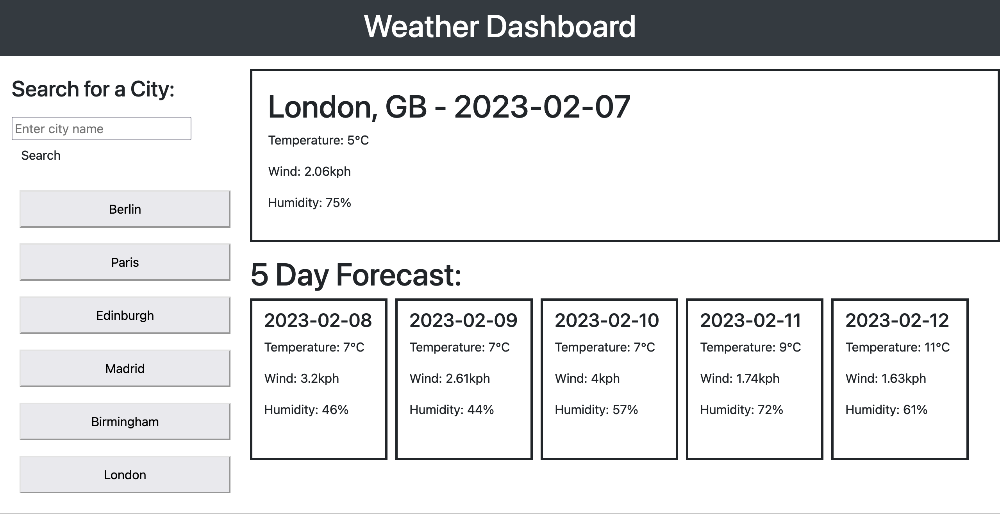

# Weather Dashboard

## Description 

This webpage is a dashboard allowing the user to input the name of any city and by clicking return, they are able to see the weather forecast for today as well as the next five days.

The page is built using a combination of HTML, CSS and JavaScript and also uses the jQuery Library for calling the OpenWeatherMap API (using AJAX) and to quickly link the HTML elements to the JavaScript variables.

This task has given me a real appreciation of the attention to detail required when coding. There were several times where I had missed a "#" key and the link to the HTML element would not work, yet the browser does not throw any errors and I would be confused as to why things weren't working. Nonetheless, the webpage is fully functional and I have learned a huge amount through this task.

### Useful Links
[GitHub Repository: 08-Weather-Dashboard](https://github.com/barrylui88/08-Weather-Dashboard)

[Deployed Page (powered by GitHub Pages)](https://barrylui88.github.io/08-Weather-Dashboard/)

## Installation

No installation is required - simply follow the URLs I have included above.

## Screenshots

###### Full Webpage Screenshot

## License

MIT License

Copyright (c) 2023 Barry Lui

Permission is hereby granted, free of charge, to any person obtaining a copy
of this software and associated documentation files (the "Software"), to deal
in the Software without restriction, including without limitation the rights
to use, copy, modify, merge, publish, distribute, sublicense, and/or sell
copies of the Software, and to permit persons to whom the Software is
furnished to do so, subject to the following conditions:

The above copyright notice and this permission notice shall be included in all
copies or substantial portions of the Software.

THE SOFTWARE IS PROVIDED "AS IS", WITHOUT WARRANTY OF ANY KIND, EXPRESS OR
IMPLIED, INCLUDING BUT NOT LIMITED TO THE WARRANTIES OF MERCHANTABILITY,
FITNESS FOR A PARTICULAR PURPOSE AND NONINFRINGEMENT. IN NO EVENT SHALL THE
AUTHORS OR COPYRIGHT HOLDERS BE LIABLE FOR ANY CLAIM, DAMAGES OR OTHER
LIABILITY, WHETHER IN AN ACTION OF CONTRACT, TORT OR OTHERWISE, ARISING FROM,
OUT OF OR IN CONNECTION WITH THE SOFTWARE OR THE USE OR OTHER DEALINGS IN THE
SOFTWARE.